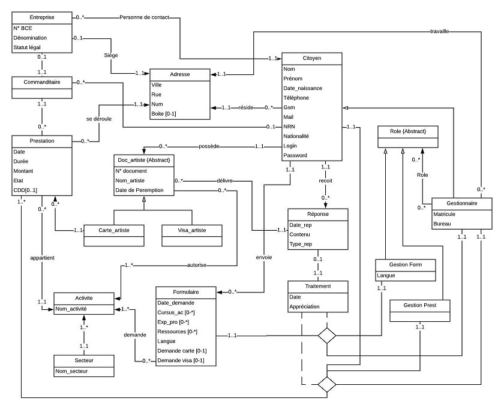
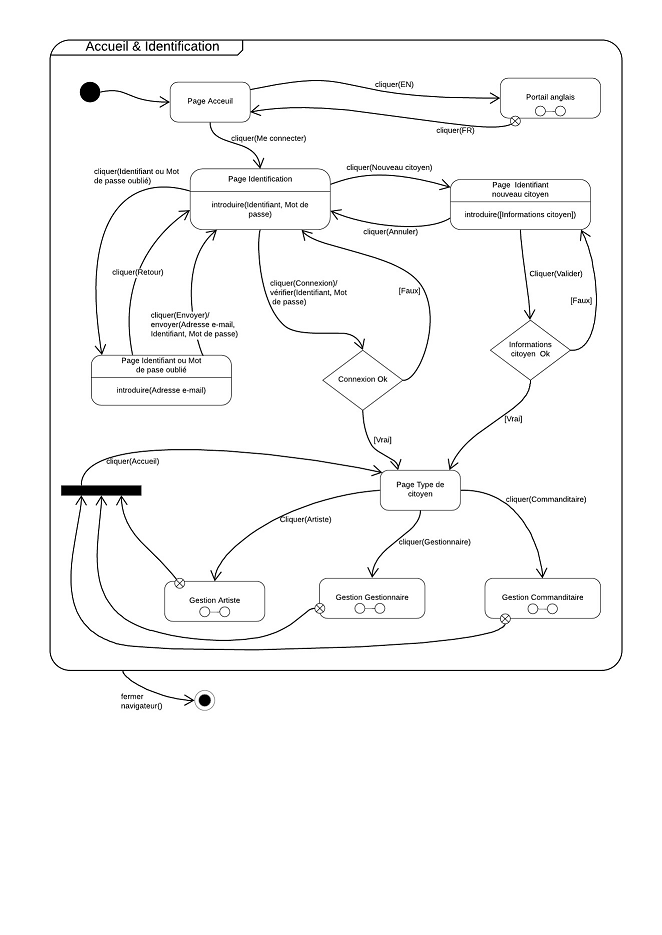
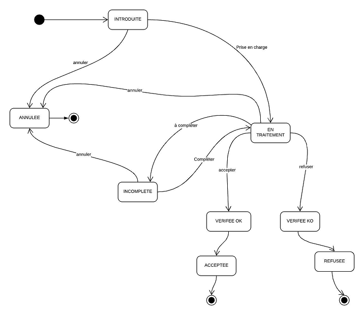
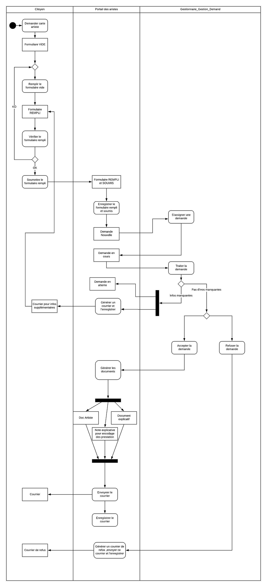
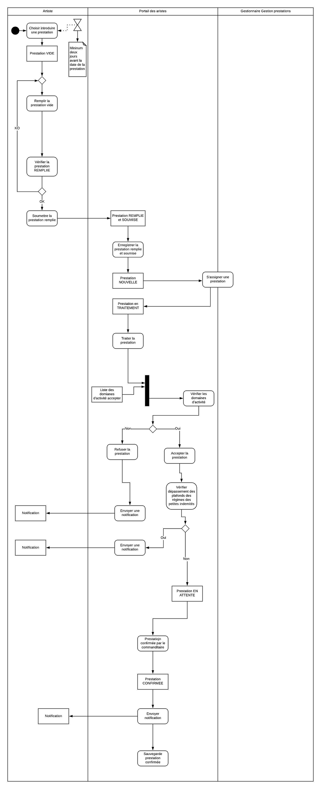

# Laboratoire d'ingénierie du logiciel - IHDCM032

Professeur: Philip MAES

Etudiants - Groupe 4:

    Sabine NÉLIS,
    
    Pascal COLLET,
    
    Bernard GEORGES,
    
    Thibault JULLIEN,
    
    Johan VANDENBERGHE,
    
    Nicolas VRANKEN

# TABLE DES MATIÈRES 

CHAPITRE 1 : INTRODUCTION
1.	Mise en contexte du problème métier	

CHAPITRE 2 : ANALYSE
1.	Lexique
2.	Domain model du système	
3.	Demandes
4.	User stories

	Analyse des user stories et des test cases,
	
5.	Site Internet

CHAPITRE 3 : ARCHITECTURE
1.	Description générale
2.	Exigences non-fonctionnelles

CHAPITRE 4 : IMPLÉMENTATION	
1.	Choix techniques, outils et standards

	Généralités

	Choix de l’architecture client/serveur
2.	Implémentation
3.	Déploiement :

	Création et initialisation de la base de données

# Introduction

La mise en contexte du problème métier

Les demandes pour obtenir le statut d'artiste sont actuellement gérées à la main via des formulaires papier. Le département gestion des artistes reçoit les demandes par courrier et envoie les réponses par courrier. Le gestion des prestations se réalise aussi par papier via un formulaire que reçoit l’artiste. Il doit renvoyer celui-ci a posteriori : le premier mois suivant l’année de leurs prestations. Le département doit aussi gérer les demandes des artistes étrangers. 

Le département gestion des artistes inscrit tous les artistes dans un fichier Excel qui est partagé par tous les membres du département. Cela pose problèmes... Et de plus, cela est inefficace !

Le but de ce projet est de digitaliser quasi l'ensemble du processus (de l'initiation à la clôture) des demandes du statut d'artiste ainsi que des prestations au moyen d'une plateforme électronique.

# Analyse

## Le lexique

De nombreux termes « métiers » sont utilisés dans ce solution document. Ils sont définis dans cette partie du chapitre 2.

*   Département de gestion des artistes : département créé en 2014 dont le but est d’aider les artistes à pouvoir se lancer un peu plus facilement mais aussi de récupérer un peu d’argent.
*   Département financier : département dont un des buts est de contrôler les prestations des artistes et les commanditaires.
*   SPF Blabla: Service public fédéral belge comprenant entre autre un département de gestion des artistes et un département financier.
*   Adresse : une adresse se compose d’une ville, d’une rue, d’un numéro et éventuellement d’une boîte postale.

        chaque citoyen réside à une adresse
        
        chaque prestation se réalise à une adresse
         
        chaque entreprise possède une adresse pour son siège
        
        chaque gestionnaire travaille à une adresse

*   Citoyen : est une personne qui  peut s’inscrire dans le système en fournissant une série d’informations : nom, prénom, date de naissance, téléphone, email, NRN, nationalité, login et password. Chaque citoyen possède une adresse.
*   Carte artiste: document délivré par le département des artistes à un citoyen lui permettant d'effectuer des prestations pour un commanditaire et bénéficier d’exonérations fiscales. Elle est délivrée pour certaines activités et leur secteur respectif.
*   Visa artiste : document délivré à un citoyen suivant certaines conditions et lui permettant d'effectuer des prestations, que ce soit pour le compte d'un commanditaire ou pas. Il est délivré pour certaines activités et leur secteur respectif.
*   Artiste: citoyen belge ou étranger possédant une carte d’artiste et/ou un visa d'artiste.
*   Employé: citoyen qui travaille au SPF Blabla dans un des départements.
*   Gestion Prestations : rôle exercé par un gestionnaire qui gère les prestations encodées par les artistes.
*   Gestion Formulaires : rôle exercé par un gestionnaire qui gère les formulaires introduits par les citoyens.
*   Gestionnaire :  employé dans le département de gestion des artistes. Il possède un matricule et un bureau. Il peut avoir comme rôle: gestion des formulaires et/ou gestion des prestations. 
*   Inspecteur: employé dans le département financier
*   Activité : Travail effectué par un artiste.
*   Secteur d’activité : Liste proposée par le département de gestion des artistes visant à regrouper les activités en catégories plus larges. Elle comprend : Audiovisuel,  Arts plastiques, Musique, Littérature, Spectacle, Théâtre, Chorégraphie ou Autre, à préciser.
*   Prestation : c’est la création et/ou l'exécution ou l'interprétation d'œuvres artistiques dans un secteur d’activités. Elle se caractérise par une date, une durée, un montant et un état. Elle appartient à une activité et son secteur d’activité.
*   Document artiste : terme générique regroupant carte artiste et visa artiste. Il est caractérisé par numéro de document, nom d’artiste, liste d’activités autorisées et une date de péremption.
*   Formulaire: document complété par un citoyen dans le but d’obtenir une carte d’artiste et/ou un visa d’artiste. Ce document comprend une partie identification et une autre partie questions relatives à l’activité.
*   Demande : introduction d’un formulaire par un citoyen afin d’obtenir une carte artiste et/ou visa artiste.
*   Commanditaire : citoyen ou entreprise qui commande une prestation à un artiste.
*   Entreprise : est caractérisée par un numéro BCE, une dénomination et un statut légal. Elle possède une personne de contact et son siège se trouve à une adresse.
*   Personne de contact : est le ou les citoyens avec lequel ou lesquels il faut prendre contact pour une entreprise.
*   Réponse : courrier envoyé à une citoyen ayant introduit un formulaire. Il est caractérisé par une date de réponse, un contenu et un type de réponse.
*   RPI: Régime Petites Indemnités

## Le domain model du système

Cette section du chapitre 2, nous permet de décrire la digitalisation du département de gestion des artistes du SPF BlaBla. Nous nous aidons de différents types de diagrammes UML.

Sur la feuille suivante, vous trouverez la figure 1 qui est un diagramme de classes du portail des Artistes.

Ci-dessous, se trouve les contraintes associées à la figure 1 :
*   Un employeur est soit une entreprise soit un citoyen (XOR)
*   Le Secteur_d’Activité d’un Doc-artiste est un sous-ensemble du Secteur_d’Activité d’un Formulaire
*   La langue du Formulaire doit correspondre à la langue du Gestionnaire (dont le rôle est Gestion_Form qui le traite
*   Un Citoyen étrangé ne peut introduire un Formulaire que pour une Demande_Artiste
*   Un Citoyen peut introduire un Formulaire pour une Demande_visa et/ou une Demande_carte

## Figure 1 : Diagramme de classes du Portail des Artistes

## Figure 2 : Diagramme de séquence du fonctionnement nominal du Portail des Artistes

Les demandes

## Figure 3 : Machine à états pour les statuts d’une demande

## Figure 4 : Diagramme d’activité d’une demande

## Figure 5 : Diagramme d’activité pour une prestation.

# Les user stories

Analyse des user stories et des test cases

## Schéma général

### Use Cases 1 Se connecter au site Portail des Artistes 

* UC 1. Se connecter au site Portail des Artistes. 

    Description : Un citoyen charge la page web de connexion du Portail des Artistes et il introduit son identifiant et son mot de passe. Après vérification par le système, le citoyen arrive sur la page d’accueil du site. 
    
#### Préconditions :
    * Le S.I. Portail des Artistes est opérationnel et est disponible
    * Le citoyen est sur la page de connexion du site Portail des Artistes
    * Le citoyen connaît son identifiant et son mots de passe

Scénario 

UC 1. Se connecter au site Portail des Artistes 

Citoyen 

S.I. Portail des Artistes 

1. Le citoyen tape son identifiant 
2. Le citoyen tape son mot de passe 
3. Le citoyen clique sur le bouton de connexion "Login" 
4. Le système vérifie que l’identifiant existe dans la base de donnée 
5. Le système vérifie que le mot de passe dans la base de donnée associé à l’identifiant est identique au mot de passe fournit par le citoyen 
6. Le système donne l’accès à la page d’accueil du site Portail des Artistes 

#### Postconditions :
    * Le S.I. Portail des Artistes fonctionne correctement et est disponible
    * Le citoyen est sur la page d’accueil du site Portail des Artistes

#### Extension :
    * UC 1.A Le citoyen a oublié son mot de passe
    * UC 1.B Le citoyen a introduit un identifiant inconnu
    * UC 1.C Le citoyen a introduit un mot de passe différent du mot de passe associé à l’identifiant dans le S.I. Portail des Artistes

UC 1.A Le citoyen a oublié son mot de passe «extends» UC 1 . 
Description : Un citoyen charge la page de connexion du Portail des Artistes et ne connaît plus son mot de passe. Il réinitialise son mot de passe et introduit un nouveau mot de passe. Après validation de l’inscription par le système, le citoyen arrive sur la page d’accueil du site. 

#### Préconditions :
    * Le S.I. Portail des Artistes est opérationnel et est disponible
    * Le citoyen est sur la page de connexion du site Portail des Artistes
    * Le citoyen est déjà inscrit sur le site mais ne connait plus son mot de passe 

Scénario 

UC 1.A Le citoyen a oublié son mot de passe «extends» UC 1 

Citoyen 

S.I. Portail des artistes 

Idem UC 1 jusqu’à l’étape 2 

2. Le citoyen clique sur "Mot de passe oublié" 
3. Le système envoi un email avec un lien pour réinitialiser le mot de passe et introduire un nouveau mot de passe 
4. Le citoyen clique sur le lien 
5. Le système charge la page de réinitialisation du mot de passe 
6. Le citoyen introduit son nouveau mot de passe 
7. Le système enregistre le mot de passe dans la base de donnée 

Fin de l’UC 1.A retour à l’UC 1 

#### Postconditions :
    * Le S.I. Portail des Artistes fonctionne correctement et est disponible
    * Le citoyen est sur la page de connexion du site Portail des Artistes 

UC 1.B Le citoyen a introduit un identifiant inconnu «extends» UC 1 . 

Description : Un citoyen charge la page de connexion du Portail des Artistes et introduit un identifiant inconnu par le système. Le système affiche l’erreur et invite le citoyen à recommencer.

#### Préconditions :
    * Le S.I. Portail des Artistes est opérationnel et est disponible
    * Le citoyen est sur la page de connexion du site Portail des Artistes 

Scénario 

UC 1.B Le citoyen a introduit un identifiant inconnu «extends» UC 1 

Citoyen 

S.I. Portail des artistes 

Idem UC 1 jusqu’à l’étape 4 

4. Le système ne trouve pas l’identifiant dans la base de donnée 
5. Le système affiche "Identifiant ou mots de passe erroné" 

Fin de l’UC 1.B retour à l’UC 1 

#### Postconditions :
    * Le S.I. Portail des Artistes fonctionne correctement et est disponible
    * Le citoyen est sur la page de connexion du site Portail des Artistes 

UC 1.C Le citoyen a introduit un mot de passe différent du mot de passe associé à l’identifiant dans le S.I. Portail des Artistes «extends» UC 1 . 

Description : Un citoyen charge la page de connections du Portail des Artistes et introduit un mots de passe différent de celui qui est enregistré par le système pour cet identifiant. Le système indique l’erreur et invite le citoyen à recommencer. 

#### Préconditions :
    * Le S.I. Portail des Artistes est opérationnel et est disponible
    * Le citoyen est sur la page de connexion du site Portail des Artistes 

Scénario 

UC 1.C Le citoyen a introduit un mot de passe différent du mot de passe associé à l’identifiant dans le S.I. Portail des Artistes «extends» UC 1 

Citoyen 

S.I. Portail des artistes 

Idem UC 1 jusqu’à l’étape 5 

5. Le système constate que le mot de passe associé à l’identifiant dans la base de donnée est différent au mot de passe fournit par le citoyen 
6. Le système affiche "Identifiant ou mot de passe erroné" 

Fin de l’UC 1.C retour à l’UC 1 

#### Postconditions :
    * Le S.I. Portail des Artistes fonctionne correctement et est disponible 
    * Le citoyen est sur la page de connexions du site Portail des Artistes 

Test cases 1 Se connecter au site Portail des Artistes 

Nom du projet 
Le portail des artistes 
Nom du scénario 
Test de connexion au site Portail des Artistes 
Auteur 

Date de la création 

Vérifier par 

Date de la vérification 

#### Précondition 
Le S.I. Portail des Artistes est opérationnel et est disponible 
Valeur en base de donnée 
Identifiant : test1 
Mot de passe : i234 
Post condition 
Le Site Portail des Artistes est disponible
Si la connexion est réussi : la page d’accueil est chargé
Si la connexion est en échec : la page de connexion est chargé 
ID test cases 
Nom du test cases 
Étapes du test cases 
Données du test cases 
Résultat souhaité 
Résultat actuel 
Status 

* TC 1.1
    Test avec des données valides 

    Charger la page de connexion 
    Entrer l’identifiant 
    Entrer le mot de passe 
    Cliquer sur "Login" 

    Id : test1 Mp : i234 
    Connexion réussis 

* TC 1.2 
    Test avec un identifiant non valide 
    Id : test Mp : i234 
    Connexion en échec 

* TC 1.3 
    Id : test12 Mp : i234 

* TC 1.4 
    Id : Test1 Mp : i234 

TC 1.5 
    Test avec un mot de passe non valide 
    Id : test1 Mp : 1234 

* TC 1.6 
    Id : test1 Mp : I234 

* TC 1.7 
    Id : test1 Mp : 234 

* TC 1.8 
    Id : test1
    Mp : i2345678 

* TC 1.9 
    Test sans un mot de passe 
    Id : test1 Mp : 

* TC 1.10
    Test sans identifiant
    Id :
    Mp :

### Use Cases 2 S’inscrire sur le Portail des Artistes 

UC 2 S’inscrire sur le Portail des Artistes. 

Description : Un citoyen charge la page de connexion du Portail des Artistes et s’inscrit sur le site. Après validation de l’inscription par le système, le citoyen arrive sur la page d’accueil du site. 

#### Préconditions :
    * Le S.I. Portail des Artistes est opérationnel et est disponible
    * Le citoyen est sur la page de connexion du site Portail des Artistes 
    * Le citoyen ne s’est jamais inscrit sur le site 

Scénario 

UC 2 Inscription d’un citoyen 

Citoyen 

S.I. Portail des Artistes 

1. Le citoyen clique sur le bouton "nouvel utilisateur" 
2. Le système charge la page nouveau utilisateur 
3. Le citoyen introduit un identifiant 
4. Le système vérifie que l’identifiant n’est pas encore dans la base de donnée 
5. Le citoyen introduit le mot de passe et clique sur "Valider" 
6. Le système enregistre l’identifiant et son mot de passe 
7. Le système ouvre la page des données du profil à compléter 
8. Le citoyen fournit les informations deman- dées sur la page et clique sur "Login" 
9. «includes» UC 3.1 Vérifier les champs obligatoire et le format des données 
10. Le système enregistre les informations dans la base de donnée et donne l’accès à la page d’accueil du site Portail des Artistes 

#### Postconditions :
    * Le S.I. Portail des Artistes fonctionne correctement et est disponible
    * Le citoyen est sur la page d’accueil du site Portail des Artistes 

Extension :
    * UC 2.A L’identifiant est déjà repris dans la base de données 

UC 2.A L’identifiant est déjà repris dans la base de donnée «extends» UC 2. 
Description : Un citoyen charge la page de connexion du Portail des Artistes et s’inscrit sur le site mais l’identifiant encodé existe déjà dans la base de donnée. Le système rejette la demande de création et invite le citoyen à recommencer la demande. 
#### Préconditions :
    * Le S.I. Portail des Artistes est opérationnel et est disponible
    * Le citoyen est sur la page de connexion du site Portail des Artistes 
    * Le citoyen ne s’est jamais inscrit sur le site 
Scénario 
UC 2.A L’identifiant est déjà repris dans la base de donnée «extends» UC 2 
Citoyen 
S.I. Portail des Artistes 
Idem UC 2 jusqu’à l’étape 4 

4. Le système trouve un identifiant identique dans la base de donnée 
5. Le système affiche "identifiant non disponible" 

Fin de l’UC 2.A, retour à l’UC 2 étape 3 

#### Postconditions :
    * Le S.I. Portail des Artistes fonctionne correctement et est disponible 
    * Le citoyen est sur la page d’accueil du site Portail des Artistes 

Test cases 2 S’inscrire sur le site Portail des Artistes 

Nom du projet 
Le portail des artistes 
Nom du scénario 
Test d’inscription sur le site Portail des Artistes 
Auteur 

Date de la création 

Vérifier par 

Date de la vérification 

Précondition 
Le Site Portail des Artistes est disponible 
Valeur en base de donnée 
Identifiant : test1 Mots de passe : i234 
Post condition 
Le Site Portail des Artistes est disponible
Si l’inscription est réussie : la page d’accueil est chargé
Si l’inscription est en échec : la page d’inscription est chargé 
ID test cases 
Nom du test cases 
Étapes du test cases 
Données du test cases 
Résultat souhaité 
Résultat actuel 
Status 

TC 2.1 

Test d’inscription avec un identifiant inexistant 
1. Charger la page de connexion 
2. Cliquer sur nouvelle inscription 
3. Entrer l’identifiant
4. Entrer le mot de passe
5. Cliquer sur connexion 
Id : teSt2 Mp : i5Ts 
Inscription réussie 

TC 2.2 
Test d’inscription avec un mot de passe existant 
Id : teSt3 Mp : i234 

TC 2.3 
Test d’inscription avec un identifiant existant 
Id : test1 Mp : 654t 
Inscription en échec 

TC 2.4 
Test d’inscription sans identifiant 
Id : Mp : 

TC 2.5 
Test d’inscription avec un identifiant non conforme 
Id : à déterminer Mp : 2377 

TC 2.6 
Test d’inscription sans mot de passe 
Id : test3 Mp : 

TC 2.7 
Test d’inscription avec un mot de passe trop long 
Id : test3
Mp : 1235476800ss0abcdefghijklm 

TC 2.8 
Test inscription avec un mot de passe trop faible 
Id : test3 Mp :0000 

TC 2.9 
Id : test3 Mp :1234 

### Use Cases 3 Demander une carte artiste 

UC 3 Demander une carte artiste. 
Description : Un citoyen, après s’être identifié sur le site Portail des Artiste, arrive sur la page d’accueil, entre dans la zone "je suis un artiste" et fait la demande d’une carte artiste sur le site. Il rempli le formulaire avec les données demandés et il fournit les preuves d’une expérience professionnelle ou des études effectués (via des liens ou des pdf). Le système se charge de l’envoi du formulaire au gestionnaire concerné. 
#### Préconditions :
    * Le S.I. Portail des Artistes est opérationnel et est disponible 
    * Le système a identifié le citoyen
    * Le citoyen est sur la page artiste du site Portail des Artistes 
Scénario 
UC 3 Demander une carte artiste 
Citoyen 
S.I. Portail des Artistes 
1. Le citoyen clique sur le bouton "Demander une carte artiste" 

2. Le système charge la page 1 du formulaire de demande de carte artiste 
3. Le citoyen clique sur "Étape suivante" après avoir lu les informations affichés 

4. Le système charge la page 2 identification du formulaire de demande de carte artiste et charge les informations du citoyen repris dans la base de données 
5. «includes» UC 3.5 (Vérifier les données affichées) sur la page 2 du formulaire 
6. Le citoyen clique sur "Étape suivante" 

7. Le système charge la page 3 du formulaire de demande de carte artiste 
8. «includes» UC 3.2 (Ajouter un secteur, une activité et la description) autant de fois qu’il y a d’activités à enregistrer 
9. Le citoyen clique sur "Étape suivante" 

10. Le système charge la page 4 du formulaire de demande de carte artiste 
11. «includes» UC 3.3 (Ajouter une annexe et sa description) autant de fois qu’il y a d’annexes à enregistrer 
12. «includes» UC 3.4 (Cocher 2 cases et confirmer l’envoi) 

#### Postconditions :
    * Le S.I. Portail des Artistes fonctionne correctement et est disponible 
    * Le citoyen est sur la page artiste du site Portail des Artistes
    * Une demande de carte artiste a été enregistré 

UC 3.1 Vérifier les champs obligatoire et le format des données. 
Description : Le système vérifie que les champs obligatoires ne sont pas vide et que le format des données est correct. 
#### Préconditions :
    * Le S.I. Portail des Artistes est opérationnel et est disponible
    * Le citoyen est sur la page de profil 
Scénario :
UC 3.1 Vérifier les champs obligatoire et le format des données 
Citoyen 
S.I. Portail des Artistes 

1. Le système vérifie que tous les champs obligatoires sont remplis 

2. Le système vérifie le format des données 

#### Postconditions :
    * Le S.I. Portail des Artistes fonctionne correctement et est disponible 
    * Le citoyen est sur la page de profil 

Extension :
    * UC 3.1.A Un ou plusieurs champs obligatoires sont manquants
    * UC 3.1.B Les données fournis ne correspondent pas au format attendu 

UC 3.1.A Un ou plusieurs champs obligatoires sont manquants «extends» UC 3.1 
Description : Le système signale les champs manquant et invite le citoyen à les compléter. 
#### Préconditions :
    * Le S.I. Portail des Artistes est opérationnel et est disponible
     * Le citoyen est sur la page de profil 
Scénario :
UC 3.1.A Un ou plusieurs champs obligatoires sont manquants «extends» UC 3.1 
Citoyen 
S.I. Portail des Artistes 

1. Le système trouve un ou plusieurs champs obligatoires manquants 

2. Le système affiche les champs manquants 
Fin de l’UC 3.1.B, retour à l’UC précédent à l’étape X − 1
avec X étape par lequel l’UC précédent est rentré dans l’UC 3.1 

#### Postconditions :
    * Le S.I. Portail des Artistes fonctionne correctement et est disponible 
    * Le citoyen est sur la page de profil 

UC 3.1.B Les données fournis ne correspondent pas au format attendu «extends» UC 3.1. 
Description : Le système vérifie que les champs obligatoires ne sont pas vide et il signale que les données fournis ne correspondent pas au format souhaité et l’invite à les corriger. 
#### Préconditions :
    * Le S.I. Portail des Artistes est opérationnel et est disponible 
    * Le citoyen est sur la page de profil 
Scénario :
UC 3.1.B Les données fournis ne correspondent pas au format attendu «extends» UC 3.1 
Citoyen 
S.I. Portail des Artistes 
Idem UC 3.1 jusqu’à l’étape 1 

2. Le système trouve un ou plusieurs champs au mauvais format 

3. Le système affiche les champs erronés 
Fin de l’UC 3.1.B, retour à l’UC précédent à l’étape X − 1
avec X étape par lequel l’UC précédent est rentré dans l’UC 3.1 

#### Postconditions :
    * Le S.I. Portail des Artistes fonctionne correctement et est disponible 
    * Le citoyen est sur la page de profil

### Use Cases 3.2 Ajouter un secteur, une activité et la description 
Description : Le citoyen clique sur "Ajouter une activité". Il choisit un secteur dans le menu déroulant, il rajoute une activité et fournit une description détaillant l’activité. 
#### Préconditions :
    * Le S.I. Portail des Artistes est opérationnel et est disponible 
    * Le citoyen est sur la page 3 du formulaire de demande 
Scénario :
UC 3.2 Ajouter un secteur, une activité et la description 
Citoyen 
S.I. Portail des Artistes 
1. Le citoyen clique sur "Ajouter une activité" 

2. Le système affiche une ligne contenant le menu déroulant "Secteur", une zone pour en- coder l’activité et une zone pour encoder la description 
3. Le citoyen choisi un secteur 

4. Le citoyen tape la nature de l’activité 

5. Le citoyen tape une description de l’acti- vité 

#### Postconditions :
    * Le S.I. Portail des Artistes fonctionne correctement et est disponible 
    * Le citoyen est sur la page 3 du formulaire de demande 

### Use Cases 3.3 Ajouter une annexe et la description 
Description : Le citoyen clique sur "Ajouter une annexe". Il fournit l’annexe à ajouter et une description détaillant l’annexe. 
#### Préconditions :
    * Le S.I. Portail des Artistes est opérationnel et est disponible 
    * Le citoyen est sur la page 4 du formulaire de demande 
Scénario 
UC 3.3 Ajouter une annexe et la description 
Citoyen 
S.I. Portail des Artistes 
1. Le citoyen clique sur "Ajouter une annexe" 

2. Le système affiche une zone permettant de rajouter un fichier ou un lien et une zone pour encoder la description de l’annexe 
3. Le citoyen choisi le fichier à ajouter 

4. Le système télécharge le fichier 
5. Le citoyen tape une description de l’annexe 

#### Postconditions :
    * Le S.I. Portail des Artistes fonctionne correctement et est disponible
    * Le citoyen est sur la page 4 du formulaire de demande 
Extension :
    * UC 3.3.A Le citoyen ajoute un lien vers une annexe 

UC 3.3.A Le citoyen ajoute un lien vers une annexe «extends» UC 3.3 
Description : Le citoyen clique sur "Ajouter une annexe". Il fourni le lien vers l’annexe à ajouter et une description détaillant l’annexe. 
#### Préconditions :
    * Le S.I. Portail des Artistes est opérationnel et est disponible
     * Le citoyen est sur la page 4 du formulaire de demande 
Scénario :
UC 3.3.A Le citoyen ajoute un lien vers une annexe «extends» UC 3.3 
Citoyen 
S.I. Portail des Artistes 
Idem UC 3.3 jusqu’à l’étape 2 
3. Le citoyen ajoute le lien vers l’annexe à ajouter 

4. Le citoyen tape une description de l’annexe 

 #### Postconditions :
    * Le S.I. Portail des Artistes fonctionne correctement et est disponible 
    * Le citoyen est sur la page 4 du formulaire de demande 

### Use Cases 3.4 Cocher 2 cases et confirmer l’envoi 
Description : Le citoyen coche les cases obligatoires et clique sur "Confirmation pour envois". Le système après vérification envois la demande et charge la page d’artiste. 
#### Préconditions :
    * Le S.I. Portail des Artistes est opérationnel et est disponible 
    * Le citoyen est sur la page 4 du formulaire de demande 
Scénario 
UC 3.4 Cocher 2 cases et confirmer l’envoi 
Citoyen 
S.I. Portail des Artistes 
1. Le citoyen coche 
    *  "Je certifie sur l’honneur que la présente demande est correcte et com- plète, et que j’ai pris connaissance des communications importantes annexées." 
    *  "Je certifie sur l’honneur que les prestations que j’effectue et les œuvres que je réalise sont de nature artistique.". 

2. Le citoyen clique sur "Confirmation pour envoi". 

3. Le système vérifie que les 2 cases à cocher sont valides 

4. Le système enregistre la demande 

5. Le système renvoie à la page artiste du site Portail des Artistes 

#### Postconditions :
    * Le S.I. Portail des Artistes fonctionne correctement et est disponible 
    * Le citoyen est sur la page artiste du site Portail des Artistes 

Extension :
    * UC 3.4.A Une ou plusieurs cases à cocher ne le sont pas 


UC 3.4.A Une ou plusieurs cases à cocher ne le sont pas «extends» UC 3.3
Description : 
#### Préconditions :
    * Le S.I. Portail des Artistes est opérationnel et est disponible 
    * Le citoyen est sur la page 4 du formulaire de demande 
Scénario 
UC 3.4.A Une ou plusieurs cases à cocher ne le sont pas «extends» UC 3.4 
Citoyen 
S.I. Portail des Artistes 
1. Le citoyen ne coche pas les cases ou n’en coche qu’une.

2. Le citoyen clique sur "Confirmation pour envoi". 

3. Le système constate que une ou plusieurs cases à cocher ne le sont pas 

4. Le système invite le citoyen à corriger l’er- reur avant de poursuivre 
Fin UC 3.4.A, retour à l’UC 3.4 à l’étape 1 

#### Postconditions :
    * Le S.I. Portail des Artistes fonctionne correctement et est disponible 
    * Le citoyen est sur la page 4 du formulaire de demande 

### Use Cases 3.5 Vérifier les données affichées 
Description : Le citoyen vérifie les données personnel que le système affiche à l’écran. 
#### Préconditions :
    * Le S.I. Portail des Artistes est opérationnel et est disponible
    * Le citoyen est sur une page affichant des données enregistrées en base de donnée 
Scénario :
UC 3.5 Vérifier les données affichées 
Citoyen 
S.I. Portail des Artistes 
1. Le citoyen vérifie les données issues de la base de donnée et affichés sur la page 

#### Postconditions :
    * Le S.I. Portail des Artistes fonctionne correctement et est disponible
    * Le citoyen est sur une page affichant des données enregistrées en base de donnée 
Extension :
    * UC 3.5.A Une ou plusieurs données affichées ne sont pas correctes 

UC 3.5.A Une ou plusieurs données affichées ne sont pas correctes «extends» UC 3.3
Description : 
#### Préconditions :
    * Le S.I. Portail des Artistes est opérationnel et est disponible
    * Le citoyen est sur une page affichant des données enregistrées en base de données 
Scénario 
UC 3.5.A Une ou plusieurs données affichées ne sont pas correctes «extends» UC 3.5 
Citoyen 
S.I. Portail des Artistes 

1. Le citoyen constate qu’une ou plusieurs données affichées ne sont pas correctes 
2. Le citoyen clique sur "mon profil" 

Fin UC 3.5.A, début de l’UC 5 à l’étape 2 

#### Postconditions :
    * Le S.I. Portail des Artistes fonctionne correctement et est disponible 
    * Le citoyen est sur la page de son profil 

Test cases 3 Demander une carte artiste 

Nom du projet 
Le portail des artistes 
Nom du scénario 
Test de demande de carte artiste 
Auteur 
Date de la création 
Vérifier par 
Date de la vérification 

#### Précondition 
Le S.I. Portail des Artistes est opérationnel et est disponible 
Le système a identifié le citoyen
Le citoyen est sur la page citoyen du site Portail des Artistes 
Valeur en base de donnée 
Nom : Dupont ;Prénom : Pierre ;Adresse : rue Ville 

#### Postcondition 
Le S.I. Portail des Artistes fonctionne correctement et est disponible Le citoyen est sur la page 1 du formulaire de demande de carte artiste 
ID test cases 
Nom du test cases 
Étapes du test cases 
Données du test cases 
Résultat souhaité 
Résultat actuel 
Status 

TC 3.0.1 
Test affichage des informations 
1. Le citoyen clique sur le bouton "Demander une carte artiste" 
N/A 
Affichage formulaire page 1 

TC 3.0.2 
Test affichage des données pré-remplies 
1. cf TC 3.0.1 
2. Le citoyen clique sur le bouton "Etape suivante" 
N/A 
Affichage formulaire page 2 avec les valeurs en base de données 

TC 3.0.3 
Test affichage du formulaire page 3 
1. cf TC 3.0.2 
2. Le citoyen clique sur le bouton "Etape suivante" 
N/A 
Affichage formulaire page 3 

TC 3.0.4 
Test sans secteur 
1. cf TC 3.0.3 
2. Le citoyen clique sur le bouton "Etape suivante" 
N/A 
Affichage d’un message d’erreur 

TC 3.0.5 
Test avec secteur et sans activité 
1. cf TC 3.0.3 
2. Le citoyen sélection un secteur d’activité 
3. Le citoyen clique sur le bouton "Etape suivante" 
Secteur : Peinture 
Affichage d’un message d’erreur 

TC 3.0.6 
Test avec secteur et activité 
1. cf TC 3.0.3 
2. Le citoyen sélection un secteur d’activité 
3. Le citoyen nomme 
l’activité 
4. Le citoyen clique sur le bouton "Etape suivante" 
Secteur : Peinture Activité : Peinture sur toile 
Affichage formulaire page 4 

TC 3.0.7 
Test cases cochées 
1. cf TC 3.0.6 
2. Le citoyen coche les 2 
cases 
3. Le citoyen clique sur le 
bouton "confirmation pour envoi" 
N/A 
Envoi confirmé 

TC 3.0.8 
Test case unique cochée 
1. cf TC 3.0.6 
2. Le citoyen coche une seule case 
3. Le citoyen clique sur le 
bouton "confirmation pour envoi" 
N/A 
Affichage d’un message d’erreur 

TC 3.0.9 
Test aucune case cochée 
1. cf TC 3.0.6 
2. Le citoyen clique sur le bouton "confirmation pour envoi" 
N/A 
Affichage d’un message d’erreur 


### Use Cases 4 Demander d’une visa d’artiste 

Description : Un citoyen , après s’être identifié sur le site Portail des Artiste, arrive sur la page d’accueil, entre dans la zone "Je suis un artiste" et fait la demande d’une visa artiste sur le site. Il remplit le formulaire avec les données demandés, il fournit les preuves d’une expérience professionnelle ou des certificats d’étude (via des liens ou des pdf). Le système se charge de l’envoi du formulaire au gestionnaire concerné. 
#### Préconditions :
    * Le S.I. Portail des Artistes est opérationnel et est disponible 
    * Le système a identifié le citoyen
    * Le citoyen est sur la page artiste du site Portail des Artistes 

Scénario 
UC 4 Demander d’une visa d’artiste 
Citoyen 
S.I. Portail des Artistes 

1. Le citoyen clique sur le bouton "Demander un visa d’artiste" 
2. Le système charge la page 1 du formulaire de demande de visa d’artiste 
3. Le citoyen clique sur "Étape suivante" après avoir lu les informations affichés 
4. Le système charge la page 2 du formulaire de demande de visa d’artiste 
5. «includes» UC 3.5 (Vérifier les données affichés) sur la page 2 du formulaire 
6. Le citoyen clique sur "Étape suivante" 
7. Le système charge la page 3 du formulaire de demande de visa d’artiste 
8. Le citoyen répond aux questions de la page 3 du formulaires 
9. Le citoyen clique sur "Étape suivante" 
10. Le système charge la page 4 du formulaire de demande de visa d’artiste 
11. «includes» UC 3.3 (Ajouter une annexe et sa description) autant de fois qu’il y a d’annexes à enregistrer 
12. «includes» UC 3.4 (Cocher 2 cases et confirmer l’envoi) 

#### Postconditions :
    * Le S.I. Portail des Artistes fonctionne correctement et est disponible 
    * Le citoyen est sur la page artiste du site Portail des Artistes
    * Une demande d’un visa d’artiste a été enregistré 

Test cases 4 Demander un visa artiste 

Nom du projet 
Le portail des artistes 
Nom du scénario 
Test de demande de visa artiste 
Auteur 
Date de la création 
Vérifier par 
Date de la vérification 

#### Précondition 
Le S.I. Portail des Artistes est opérationnel et est disponible 
Le système a identifié le citoyen
Le citoyen est sur la page citoyen du site Portail des Artistes 
Valeur en base de donnée 
Nom : Dupont ;Prénom : Pierre ;Nom Artiste : ... ;Adresse : rue Ville ;NRN :... ;Ntel :... ;mail :... 
#### Postcondition 
Le S.I. Portail des Artistes fonctionne correctement et est disponible 
Le citoyen est sur la page 1 du formulaire de demande de visa artiste 
ID test cases 
Nom du test cases 
Étapes du test cases 
Données du test cases 
Résultat souhaité 
Résultat actuel 
Status 

TC 4.0.1 
Test affichage des informations 
1. Le citoyen clique sur le bouton "Demander un visa artiste" 
N/A 
Affichage formulaire page 1 

TC 4.0.2 
Test affichage des données pré-remplies 
1. cf TC 4.0.1 
2. Le citoyen clique sur le bouton "Etape suivante" 
N/A 
Affichage formulaire page 2 avec les valeurs en base de données 

TC 4.0.3 
Test affichage du formulaire page 3 
1. cf TC 4.0.2 
2. Le citoyen clique sur le bouton "Etape suivante" 
N/A 
Affichage formulaire page 3 

TC 4.0.4 
Test affichage du formulaire page 4 
1. cf TC 4.0.3 
2. Le citoyen répond aux 
questions de la page 3 du formulaire 
3. Le citoyen clique sur le bouton "Etape suivante" 
N/A 
Affichage formulaire page 4 

TC 4.0.5 
Test cases cochées 
1. cf TC 4.0.4 
2. Le citoyen coche les 2 cases 
3. Le citoyen clique sur le bouton "confirmation pour envoi" 
N/A 
Envoi confirmé 

TC 4.0.6 
Test case unique cochée 
1. cf TC 4.0.4 
2. Le citoyen coche une seule 
case 
3.Le citoyen clique sur le 
bouton "confirmation pour envoi" 
N/A 
Affichage d’un message d’erreur 


### Use Cases 5 Modifier mon profil 

Description : Un citoyen, identifié sur le site Portail des Artiste, est sur une page quelconque du site sur lequel on peut accéder à son profil. 
#### Préconditions : 
    *  Le S.I. Portail des Artistes est opérationnel et est disponible 
    *  Le système a identifié le citoyen 
    *  Le citoyen est sur une page du site Portail des Artistes sur lequel on peut accéder à son profil 

Scénario 
UC 5 Modifier mon profil 
Citoyen 
S.I. Portail des Artistes 

1. Le citoyen clique sur le bouton "Mon profil" 
2. Le système charge la page du profil du ci- toyen 
3. Le système charge les données d’identifi- cation du citoyen 
4. Le système affiche les données chargées 
5. Le citoyen modifie les données erronés si nécessaire ou fourni des informations complé- mentaire non obligatoire 
6. «includes» UC 3.1 (Vérifier les champs de données) 
7. Le citoyen clique sur "Valider" 
8. Le système enregistre les modifications ef- fectués dans la base de données 
9. Le système charge la page sur laquelle le citoyen se trouvé avant de cliquer sur "Mon profil" 

#### Postconditions :
    * Le S.I. Portail des Artistes fonctionne correctement et est disponible 
    * Le citoyen est sur la page où il était avant du site Portail des Artistes 

Test cases 5 Modifier mon profil 

Nom du projet 
Le portail des artistes 
Nom du scénario 
Test sur les valeurs du profil 
Auteur 
Date de la création 
Vérifier par 
Date de la vérification 
Le S.I. Portail des Artistes est opérationnel et est disponible
Le système a identifié le citoyen
Le citoyen est sur une page du site Portail des Artistes sur lequel on peut accéder à son profil 
Précondition 
Le S.I. Portail des Artistes est opérationnel et est disponible
Le système a identifié le citoyen
Le citoyen est sur une page du site Portail des Artistes sur lequel on peut accéder à son profil 
Valeur en base de données 
Nom : Admin
Prénom : Admin
Date de naissance : 12 12 1972
Nom d’artiste : Admin
Rue : Grand rue 
Numéro : 5
Boite:
Localité: Namur 
NRN : 121272 115 01 
Numéro de GSM : 
Mail :
Numéro de téléphone : 
Nationalité: belge 
Postcondition 
Le Site Portail des Artistes est disponible
Si la validation réussi, le citoyen est sur la page accueil du site Portail des Artistes Sinon, le citoyen est sur la page profil du site Portail des Artistes 
ID test cases 
Nom du test cases 
Étapes du test cases 
Données du test cases 
Résultat souhaité 
Résultat actuel 
Status 

TC 5.1 
 
Test avec des valeurs correctes 
1. Charger la page de mon profil 
2. Encoder les valeurs
3. Cliquer sur "Login" 

Test avec des valeurs correctes 

Validation des valeurs 

TC 5.2 

Test sur le prénom, valeur absente 
NOM :
Autre: valeur OK
Validation réussie

TC 5.4 

Test sur le numéro de rue, valeur absente
Rue :
Autre: valeur OK 

TC 5.5

Test sur le numéro de rue,valeur absente
Numéro :
Autre : valeur OK

TC 5.6

Test sur la localité, valeur
absente
Localité :
Autre : valeur OK

TC 5.7

Test sur la nationalité,
valeur absente
Nationalité :
Autre : valeur OK

ID test cases 
Nom du test cases 
Étapes du test cases 
Données du test cases 
Résultat souhaité 
Résultat actuel 
Status 

TC 5.8 

Test sur le NRN, valeur absent e 

1. Charger la page de mon profil 
2. Encoder les valeurs 3. Cliquer sur "Login" 

NRN :
Autre: valeur OK 
Validation refusée 

TC 5.9 

Test sur le NRN, format des valeurs non valide 
NRN : 12721A5a2 
Autre: valeur OK 

TC 5.10 

Test sur le NRN, total des valeurs non valide 
NRN : 11111111111 
Autre: valeur OK 

TC 5.11 
Test sur le NRN, valeur ex i st ant e 

NRN : 12127211501 
utre: valeur OK 

TC 5.12 

Test sur le numéro de rue, valeur non valide 
Numéro : Abc
Autre: valeur OK 

TC 5.13 

Test sur la localité, valeur non valide 
Localité : 123 Autre: valeur OK 

TC 5.14 

Test sur le numéro de téléphone, format des valeurs non valide 
Numéro de téléphone: Ab55482-6 Autre: valeur OK 

TC 5.15 

Test sur le numéro de GSM, format des valeurs non valide 
Numéro de GSM : A b554826
Autre: valeur OK 

TC 5.16 

Test sur le mail, manque le @ 
Mail : abcb.com 
Autre: valeur OK 

TC 5.17 

Test sur le mail, manque le .com ou autre 
Mail : abc@b 
Autre: valeur OK 

Données du test valide 

Nom 
Dupont 
Prénom 
Henri 
Date de naissance 
01 01 2001 
Nom d’artiste 
Bosso 
Rue 
Petite rue d’en face 
Numéro 
6 
Boite 
Localité 
Namur 
NRN 
010101 005 22 
Nationalité 
belge 
Numéro de téléphone 
081010155 
Numéro de GSM 
0495010155 
Mail 
dupont.henry@bosso.b e 

### Use Cases 6 Ajouter une prestation 

UC 6 Ajouter une prestation
Description : Un citoyen, identifié sur le site Portail des Artiste, reconnu comme artiste et possédant une carte artiste valable, est sur la page de gestion des prestations sur lequel il peut voir les prestations déjà enregistrées. L’artiste clique sur "Ajouter une prestation", le système affiche une page dans lequel l’artiste peut introduire les données de la prestation. Après validation par l’artiste, le système enregistre les informations de la prestation en base de donnée et les affiche sur la page de gestion des prestations en dessous des autres prestations déjà enregistrées. 
#### Préconditions : 
    *  Le S.I. Portail des Artistes est opérationnel et est disponible 
    *  Le système a identifié le citoyen 
    *  Le système a reconnu le citoyen comme un artiste 
    *  Le citoyen possède une carte artiste dont la date de péremption est supérieur à la date du jour 
    *  Le citoyen est sur une page de gestion des prestations du site Portail des Artistes 
Scénario 
UC 6 Ajouter une prestation 
Citoyen 
S.I. Portail des Artistes 

1. Le citoyen clique sur le bouton "Ajouter une prestation" 
2. Le système affiche une fenêtre de prestation 
3. Le citoyen encode les données de la pres- tation dans la fenêtre 
4. Le citoyen valide les données en cliquant sur "Valider" 
5. «includes» UC 3.1 Vérifier les champs obligatoire et le format des données 
6. «includes» UC 6.1 Vérifier la validité des conditions du RIP 
7. Le système enregistre les données de la prestation en base de donnée 
8. Le système affiche les données sur la page de gestion des prestations 

#### Postconditions : 
    *  Le S.I. Portail des Artistes fonctionne correctement et est disponible 
    *  Le système a identifié le citoyen 
    *  Le système a reconnu le citoyen comme un artiste 
    *  Le citoyen possède une carte artiste dont la date de péremption est supérieur à la date du jour 
    *  Le citoyen est sur une page de gestion des prestations du site Portail des Artistes 
    *  La nouvelle prestation en base de donnée doit avoir comme état "nouveau" 
Extension :
    * UC 6.A Le système ne valide pas la prestation ajoutée 

UC 6.A Le système ne valide pas la prestation ajoutée. 
Description : Un citoyen, identifié sur le site Portail des Artiste, reconnu comme artiste et possédant une carte artiste valable, est sur la page de gestion des prestations sur lequel il peut voir les prestations déjà enregistrées. L’artiste clique sur "Ajouter une prestation", le système affiche une page dans lequel l’artiste peut introduire les données de la prestation. Le système ne valide pas la prestation car les conditions du RPI ne sont pas respecté. Le système invite le citoyen à corriger l’erreur ou à annuler l’ajout de la prestation. 
#### Préconditions : 
    *  Le S.I. Portail des Artistes est opérationnel et est disponible 
    *  Le système a identifié le citoyen 
    *  Le système a reconnu le citoyen comme un artiste 
    *  Le citoyen possède une carte artiste dont la date de péremption est supérieur à la date du jour 
    *  Le citoyen est sur une page de gestion des prestations du site Portail des Artistes 
Scénario 
UC 6.A Le système ne valide pas la prestation ajoutée «extends» UC 6 
Citoyen 
S.I. Portail des Artistes 
Idem UC 6 jusqu’à l’étape 5 

6. Le système ne valide pas la prestation 

7. Le système invite le citoyen à modifier ou annuler la prestation 
Fin de l’UC 6.A, retour à l’UC 6 étape 3 
#### Postconditions : 
    *  Le S.I. Portail des Artistes fonctionne correctement et est disponible 
    *  Le système a identifié le citoyen 
    *  Le système a reconnu le citoyen comme un artiste 
    *  Le citoyen possède une carte artiste dont la date de péremption est supérieur à la date du jour 
    *  Le citoyen est dans une fenêtre de prestation avec la prestation à ajouter affichée 

U C 6.1 Vérifier les conditions du RPI 
Description : Un citoyen, identifié sur le site Portail des Artiste, reconnu comme artiste et possédant une carte artiste valable, a introduit une nouvelle prestation ou en l’a modifiée. Le système vérifie que les conditions soit bien respectées et valide la prestation. 

#### Préconditions: 
    *  Le S.I. Portail des Artistes est opérationnel et est disponible 
    *  Le système a identifié le citoyen 
    *  Le système a reconnu le citoyen comme un artiste 
    *  Le citoyen possède une carte artiste dont la date de péremption est postérieur à la date du jour 
Scénario 
UC 6.1 Vérifier les conditions du RPI 
Citoyen 
S.I. Portail des Artistes 

1. Le système vérifie que le total des jours inscrit sur la carte artiste ne dépasse pas le nombredes 30 jours de prestations par année 
2. Lesystèmevérifiequelemontant d’indemnité déclaré par jour ne dépasse pas 128.93 euros 
3. Le système vérifie que le montant d’indemnité totale des prestations déjà déclaré est inférieur ou égal à 2493.27 euros 
4. Le système vérifie que chaque prestation pour le même commanditaire soit inférieur à 7 jours consécutif 
5. Le système vérifie que les dates des prestations soient antérieur à la date de péremption de la carte artiste utilisée 
6. Le système valide la prestation 

#### Postconditions: 
    *  Le S.I. Portail des Artistes fonctionne correctement et est disponible 
    *  Le système a identifié le citoyen 
    *  Le système a reconnu le citoyen comme un artiste 
    *  Le citoyen possède une carte artiste dont la date de péremption est supérieur à la date du jour 
Extension : 
    *  UC 6.1.A Le système comptabilise plus de 30 jours de prestation pour l’année en cours 
    *  UC 6.1.B Le système constate que le montant de 128.93 e est dépassé 
    *  UC 6.1.C Le système constate que le montant de 2493.27e est dépassé 
    *  UC 6.1.D Le système constate que la prestation dépasse les 7 jours consécutifs chez le même commanditaire 
    *  UC 6.1.E Les dates de prestation dépassent la date de péremption de la carte artiste utilisé 

UC 6.1.A Le système comptabilise plus de 30 jours de prestation pour l’année extends UC6.1

Description : Un citoyen, identifié sur le site Portail des Artiste, reconnu comme artiste et possédant une carte artiste valable, a introduit une nouvelle prestation ou en l’a modifiée. Le système comptabilise plus de 30 jours de prestation pour l’année en cours et ne valide pas la pr est at i on. 

#### Préconditions: 
    * Le S.I. Portail des Artistes est opérationnel et est disponible 
    *  Le système a identifié le citoyen 
    *  Le système a reconnu le citoyen comme un artiste 
    *  Le citoyen possède une carte artiste dont la date de péremption est supérieur à la date du jour 

Scénario 

UC 6.1.A Le système comptabilise plus de 30 jours de prestation pour l’année en cours «extends» UC 6.1 

Citoyen 

S.I. Portail des artistes 

1. Le nombre totale des jours de prestation est supérieur à 30 jours pour l’année en cours 
2. Le système ne valide pas la prestation 

Fin de l’UC 6.1.A 

#### Postconditions: 
    *  Le S.I. Portail des Artistes fonctionne correctement et est disponible 
    *  Le système a identifié le citoyen 
    *  Le système a reconnu le citoyen comme un artiste 
    *  Le citoyen possède une carte artiste dont la date de péremption est supérieur à la date du jour 
    *  Le système valide les conditions du RPI 

UC 6.1.B Le système constate que le montant de 128.93 e est dépassé 
Description : Un citoyen, identifié sur le site Portail des Artiste, reconnu comme artiste et possédant une carte artiste valable, a introduit une nouvelle prestation ou en l’a modifiée. Le système constate que le montant d’indemnité par jour dépasse 128.93e et ne valide pas la prestation. 

#### Préconditions: 
    *  Le S.I. Portail des Artistes est opérationnel et est disponible 
    *  Le système a identifié le citoyen 
    *  Le système a reconnu le citoyen comme un artiste 
    *  Le citoyen possède une carte artiste dont la date de péremption est supérieur à la date du jour 

Scénario 

UC 6.1.B Le système constate que le montant de 128.93 e est dépassé«extends» UC 6.1 

Citoyen 

S.I. Portail des artistes 

Idem UC 6.1 jusqu’à l’étape 1 

2. Lemontant del’indemnitédelaprestation est supérieur à 128.93 e par jour 
3. Le système ne valide pas la prestation 

Fin de l’UC 6.1.B 

#### Postconditions: 
    *  Le S.I. Portail des Artistes fonctionne correctement et est disponible 
    *  Le système a identifié le citoyen 
    *  Le système a reconnu le citoyen comme un artiste 
    *  Le citoyen possède une carte artiste dont la date de péremption est supérieur à la date du jour 
    *  Le système ne valide pas les conditions du RPI 

UC 6.1.C Le système constate que le montant de 2493.27e est dépassé «extends» UC 6.1 . 

Description : Un citoyen, identifié sur le site Portail des Artiste, reconnu comme artiste et possédant une carte artiste valable, a introduit une nouvelle prestation ou en l’a modifiée. Le système constate que le montant d’indemnité totale pour l’année encours dépasse 2493.27e et ne valide pas la prestation. 

#### Préconditions: 
    *  Le S.I. Portail des Artistes est opérationnel et est disponible 
    *  Le système a identifié le citoyen 
    *  Le système a reconnu le citoyen comme un artiste 
    *  Le citoyen possède une carte artiste dont la date de péremption est supérieur à la date du jour 

Scénario 
UC 6.1.C Le système constate que le montant de 2493.27eest dépassé «extends» UC 6.1 
Citoyen 
S.I. Portail des artistes 
Idem UC 6.1 jusqu’à l’étape 2 

3. Le montant de l’indemnité de la prestation est supérieur à 2493.27 euros  pour l’année en cours 
4. Le système ne valide pas la prestation 

Fin de l’UC 6.1.C 

#### Postconditions: 
    *  Le S.I. Portail des Artistes fonctionne correctement et est disponible 
    *  Le système a identifié le citoyen 
    *  Le système a reconnu le citoyen comme un artiste 
    *  Le citoyen possède une carte artiste dont la date de péremption est supérieur à la date du jour 
    *  Le système ne valide pas les conditions du RPI 

UC 6.1.D Le système constate que la prestation dépasse les 7 jours consécutifs chez le même commanditaire «extends» UC 6.1 . 
Description : Un citoyen, identifié sur le site Portail des Artiste, reconnu comme artiste et possédant une carte artiste valable, a introduit une nouvelle prestation ou en l’a modifiée. Le système comptabilise plus de 30 jours de prestation pour l’année en cours et ne valide pas la pr est at i on. 

#### Préconditions: 
    *  Le S.I. Portail des Artistes est opérationnel et est disponible 
    *  Le système a identifié le citoyen 
    *  Le système a reconnu le citoyen comme un artiste 
    *  Le citoyen possède une carte artiste dont la date de péremption est supérieur à la date du jour

Scénario 
UC 6.1.D Le système constate que la prestation dépasse les 7 jours consécutifs chez le même commanditaire «extends» UC 6.1 
Citoyen 
S.I. Portail des artistes 
Idem UC 6.1 jusqu’à l’étape 3 

4. Le nombre jours consécutifs de la prestation est supérieur à 7 jours chez le même commanditaire 
5. Le système ne valide pas la prestation 

Fin de l’UC 6.1.D 

#### Postconditions: 
    *  Le S.I. Portail des Artistes fonctionne correctement et est disponible 
    *  Le système a identifié le citoyen 
    *  Le système a reconnu le citoyen comme un artiste 
    *  Le citoyen possède une carte artiste dont la date de péremption est supérieur à la datedu jour 
    *  Le système ne valide pas les conditions du RPI 

UC 6.1.E Les dates de prestation dépassent la date de péremption de la carte artiste utilisé «extends» UC 6.1 . 
Description : Un citoyen, identifié sur le site Portail des Artiste, reconnu comme artiste et possédant une carte artiste valable, a introduit une nouvelle prestation ou en l’a modifiée. Le système comptabilise plus de 30 jours de prestation pour l’année en cours et ne valide pas la prestation. 

#### Préconditions: 
    *  Le S.I. Portail des Artistes est opérationnel et est disponible 
    *  Le système a identifié le citoyen 
    *  Le système a reconnu le citoyen comme un artiste 
    *  Le citoyen possède une carte artiste dont la date de péremption est supérieur à la date du jour 
Scénario 
UC 6.1.E Les dates de prestation dépassent la date de péremption de la carte artiste utilisé «extends» UC 6.1 
Citoyen 
S.I. Portail des artistes 

Idem UC 6.1 jusqu’à l’étape 4 

5. Les dates de prestations dépassent la date de péremption de la carte artiste utilisée 
6. Le système ne valide pas la prestation 

Fin de l’UC 6.1.E 

#### Postconditions: 
    *  Le S.I. Portail des Artistes fonctionne correctement et est disponible 
    *  Le système a identifié le citoyen 
    *  Le système a reconnu le citoyen comme un artiste 
    *  Le citoyen possède une carte artiste dont la date de péremption est supérieur à la date du jour 
    *  Le système ne valide pas les conditions du RPI 

### Use Cases 7 Modifier une prestation 

UC 7 Modifier une prestation
Description : Un citoyen, identifié sur le site Portail des Artiste , reconnu comme artiste et possédant une carte artiste valable, est sur la page de gestion des prestations sur lequel il peut voir les prestations déjà enregistrées. L’artiste sélectionne la prestation à modifier et clique sur "Modifier une prestation". Le système charge une page sur laquelle il affiche les données de la prestation sélectionnée qui se trouve en base de donnée. Le citoyen modifie la prestation. Après validation par l’artiste, le système enregistre les informations de la prestation en base de donnée et affiche la prestation modifié sur la page de gestion des prestations. 
#### Préconditions : 
    *  Le S.I. Portail des Artistes est opérationnel et est disponible 
    *  Le système a identifié le citoyen 
    *  Le système a reconnu le citoyen comme un artiste 
    *  Le citoyen possède une carte artiste dont la date de péremption est supérieur à la date du jour 
    *  Le citoyen est sur la page de gestion des prestations du site Portail des Artistes 
Scénario 
UC 7 Modifier une prestation 
Citoyen 
S.I. Portail des Artistes 

1. Le citoyen sélectionne la prestation à modifier 
2. Le citoyen clique sur le bouton "Modifier une prestation" 
3. Le système charge les données de la prestation sélectionnée de la base de donnée en mémoire 
4. Le système affiche une fenêtre de prestation avec les données chargées 
5. Le citoyen modifie les données de la prestation dans la fenêtre affichée 
6. Le citoyen valide les données en cliquant sur "Valider" 
7. «includes» UC 3.1 Vérifier les champs obligatoire et le format des données 
8. «includes» UC 6.1 Vérifier la validité des conditions du RPI 
9. Le système enregistre les modifications de la prestation en base de donnée 
10. Le système affiche les modifications sur la page de gestion des prestations 

#### Postconditions : 
    *  Le S.I. Portail des Artistes fonctionne correctement et est disponible 
    *  Le système a identifié le citoyen 
    *  Le système a reconnu le citoyen comme un artiste 
    *  Le citoyen possède une carte artiste dont la date de péremption est supérieur à la date du jour 
    *  Le citoyen est sur la page de gestion des prestations du site Portail des Artistes 
    *  La prestation modifié en base de donnée doit avoir comme état "modifier" 
Extension :
    * UC 7.A Le système ne valide pas la prestation modifiée 

UC 7.A Le système ne valide pas la prestation modifiée «extends» UC 7. 
Description : Un citoyen, identifié sur le site Portail des Artiste , reconnu comme artiste et possédant une carte artiste valable, est sur la page de gestion des prestations sur lequel il peut voir les prestations déjà enregistrées. L’artiste sélectionne la prestation à modifier et clique sur "Modifier une prestation". Le système charge une page sur laquelle il affiche les données de la prestation sélectionnée qui se trouve en base de donnée. Le citoyen modifie la prestation. Après validation par l’artiste, le système refuse la modification car la prestation ne respecte pas les conditions du RPI et invite le citoyen à changer les modifications ou à les annuler. 
#### Préconditions : 
    *  Le S.I. Portail des Artistes est opérationnel et est disponible 
    *  Le système a identifié le citoyen 
    *  Le système a reconnu le citoyen comme un artiste 
    *  Le citoyen possède une carte artiste dont la date de péremption est supérieur à la date du jour 
    *  Le citoyen est sur la page de gestion des prestations du site Portail des Artistes 

Scénario
UC 7.A Le système ne valide pas la prestation modifiée «extends» UC 7 
Citoyen 
S.I. Portail des Artistes 
Idem UC 7 jusqu’à l’étape 7 

7. Le système ne valide pas la modification 
8. Le système invite le citoyen à modifier ou annuler la modification 

Fin de l’UC 7.A, retour à l’UC 7 étape 5 

#### Postconditions : 
    *  Le S.I. Portail des Artistes fonctionne correctement et est disponible 
    *  Le système a identifié le citoyen 
    *  Le système a reconnu le citoyen comme un artiste 
    *  Le citoyen possède une carte artiste dont la date de péremption est supérieur à la date du jour 
    *  Le citoyen est sur la fenêtre de prestation avec la prestation à modifier affichée 

### Use Cases 8 Annuler une prestation 

UC 8 Annuler une prestation. 
Description : Un citoyen, identifié sur le site Portail des Artiste, reconnu comme artiste et possédant une carte artiste valable, est sur la page de gestion des prestations sur lequel il peut voir les prestations déjà enregistrées. L’artiste sélectionne la prestation à annuler et clique sur "Annuler une prestation". Le système ouvre une fenêtre sur laquelle le citoyen justifie l’annulation. Après validation par le citoyen, le système met la prestation en annulation dans la base de donnée. Le système affiche la prestation modifié sur la page de gestion des prestations. 
#### Préconditions : 
    *  Le S.I. Portail des Artistes est opérationnel et est disponible 
    *  Le système a identifié le citoyen 
    *  Le système a reconnu le citoyen comme un artiste 
    *  Le citoyen possède une carte artiste dont la date de péremption est supérieur à la date du jour 
    *  Le citoyen est sur une page de gestion des prestations du site Portail des Artistes 
Scénario 
UC 8 Annuler une prestation 
Citoyen 
S.I. Portail des Artistes 

1. Le citoyen sélectionne la prestation à an- nuler 
2. Le citoyen clique sur le bouton "Annuler une prestation" 
3. Le système charge une fenêtre de justification 
4. Le citoyen enregistre la justification et valide 
5. Le système change le statut de la prestation en annulé 
6. Le système enregistre les modifications de la prestation en base de donnée 
7. Le système affiche les modifications sur la page de gestion des prestations 

#### Postconditions : 
    *  Le S.I. Portail des Artistes fonctionne correctement et est disponible 
    *  Le système a identifié le citoyen 
    *  Le système a reconnu le citoyen comme un artiste 
    *  Le citoyen possède une carte artiste dont la date de péremption est supérieur à la date du jour 
    *  Le citoyen est sur une page de gestion des prestations du site Portail des Artistes 
    *  La prestation en base de donnée doit avoir comme état "annulé" 

### Use Cases 9 Annuler l’opération en cours 
UC 9 Annuler l’opération en cours. 
Description : Un citoyen, identifié sur le site Portail des Artiste, est sur une page quelconque du site sur lequel on peut annuler. Le citoyen qui clique sur "Annuler" annule toutes les opérations en cours non encore enregistré en base de donnée et il revient à la page précédente (exemple pour une demande de carte artiste, on retourne sur la page artiste du site Portail des Artistes). 
#### Préconditions : 
    *  Le S.I. Portail des Artistes est opérationnel et est disponible 
    *  Le système a identifié le citoyen 
    *  Le citoyen est sur une page du site Portail des Artistes sur lequel on peut annuler l’opération en cours
 Scénario 
UC 9 Annuler l’opération en cours 
Citoyen 
S.I. Portail des Artistes 
1. Le citoyen clique sur le bouton "Annuler" 
2. Le système efface toutes les données en mémoire. 
3. Le système charge la page précédant la demande de modification de donnée par le citoyen ou la demande de carte ou de visa artiste 

#### Postconditions :
    * Le S.I. Portail des Artistes fonctionne correctement et est disponible 
    * Aucune modification de la base de donnée n’a été effectuée 

### Use Cases 10 Se déconnecter du site 
Description : Un citoyen, identifié sur le site Portail des Artiste, est sur une page quelconque du site. Le citoyen qui clique sur "Déconnexion". Le système charge la page connexion du site Portail des Artistes 
#### Préconditions :
    * Le S.I. Portail des Artistes est opérationnel et est disponible 
    * Le système a identifié le citoyen
    * Le citoyen est sur une page du site Portail des Artistes 
Scénario 
UC 10 Se déconnecter du site 
Citoyen 
S.I. Portail des Artistes 

1. Le citoyen clique sur le bouton "Déconnexion" 
2. Le système efface toutes les données en mémoire. 
3. Le système charge la page de connexion du site 

#### Postconditions :
    * Le S.I. Portail des Artistes fonctionne correctement et est disponible 
    * Le citoyen n’est plus identifié sur le système
    * Le citoyen est sur la page connexion du site Portail des Artistes 

### Use Cases 11 Valider une prestation pour le compte d’une société 

UC 11. Valider une prestation pour le compte d’une société. 
Description : Un citoyen, identifié par le système, est sur la page d’accueil du site Portail des Artistes. Il clique sur "Je suis un commanditaire" et arrive sur la page des commanditaires. Après avoir identifié la société pour laquelle il est le représentant, le système charge la liste des prestations déclarés par les artistes avec comme numéro de commanditaire le numéro d’entreprise enregistré par le citoyen. Le citoyen sélection la prestation à valider et clique sur "Valider une prestation". Le système charge une fenêtre reprenant une "Attestation de déclaration d’une prestation" qu’il imprime pour preuve que l’artiste a bien fait la déclaration de la prestation dans les conditions des RIP. Après l’impression et la fermeture de la fenêtre, le système met la prestation en statut valider. 
#### Préconditions:
    * Le S.I. Portail des Artistes est opérationnel et est disponible 
    * Le système a identifié le citoyen
    * Le citoyen est sur la page d’accueil du site Portail des Artistes 
Scénario 

UC 11 Valider une prestation pour le compte d’une société 
Citoyen 
S.I. Portail des Artistes 

1. Le citoyen clique sur "Je suis un commanditaire" 
2. Le système charge la page des prestations du commanditaire vide 
3. Le système charge une fenêtre d’identification du commanditaire 
4. Le citoyen coche la case "Pour le compte d’une entreprise ou une association de fait" 
5. Le citoyen introduit, dans la case numéro BCE, le numéro d’entreprise de la société et clique sur "Valider" 
6. Le système vérifie le numéro d’entreprise 
7. Lesystèmechargeunelistedesprestations ayant le même numéro d’entreprise en base de donnée pour le commanditaire 
8. Le citoyen sélectionne la prestation à vali- der et clique sur "Valider une prestation" 
9. Le système charge la fenêtre attestation de déclaration de prestation 
10. Le citoyen clique sur "Impression" 
11. Le système imprime l’attestation et met la prestation au statut de validé 
12. Le système recharge la page du commanditaire avec une liste des prestations 

#### Postconditions :
    * Le S.I. Portail des Artistes fonctionne correctement et est disponible
    * Le citoyen est sur la page des prestations du commanditaire du site Portail des Artistes 
Extension :
    * UC 11.A Numéro d’entreprise non valide
    * UC 11.B Annulation de la validation avant l’impression 
    * UC 11.C Validation d’une prestation en son nom 

UC 11.A Le numéro d’entreprise n’est pas valide «extends» UC 11 . 
Description : Un citoyen, identifié par le système, est sur la page d’accueil du site Portail des Artistes. Il clique sur "Je suis un commanditaire" et arrive sur la page des commanditaires. Après avoir identifié la société pour laquelle il est le représentant, le système indique au citoyen que le numéro d’entreprise n’est pas valide . Il invite le citoyen à recommencer l’introduction du numéro d’entreprise. 
#### Préconditions:
    * Le S.I. Portail des Artistes est opérationnel et est disponible 
    * Le système a identifié le citoyen
    * Le citoyen est sur la page d’accueil du site Portail des Artistes 

Scénario 

UC 11.A Le numéro d’entreprise n’est pas valide «extends» UC 11 
Citoyen 
S.I. Portail des artistes 

Idem UC 11 jusqu’à l’étape 5 

6. Le système constate que le numéro d’entreprise n’est pas valide 
7. Le système invite le citoyen à réintroduire le numéro d’entreprise 

Fin de l’UC 11.A retour à l’UC 11 étape 5 

#### Postconditions:
    * Le S.I. Portail des Artistes fonctionne correctement et est disponible.
    * Le citoyen est sur la page des prestations du commanditaire du site Portail des Artistes. 
    * La fenêtre d’identification du commanditaire est ouverte. 

UC 11.B Annulation de la validation avant l’impression «extends» UC 11 . 
Description : Un citoyen, identifié par le système, est sur la page d’accueil du site Portail des Artistes. Il clique sur "Je suis un commanditaire" et arrive sur la page des commanditaires. Après avoir identifié la société pour laquelle il est le représentant, le système charge la liste des prestations déclarés par les artistes avec comme numéro de commanditaire le numéro d’entreprise enregistré par le citoyen. Le citoyen sélection la prestation à valider et clique sur "Valider une prestation". Le système charge une fenêtre reprenant une "Attestation de déclaration d’une prestation". Le citoyen clique sur "Annuler". Le système ferme la fenêtre. Le système ne met pas la prestation en statut valider. 

#### Préconditions:
    * Le S.I. Portail des Artistes est opérationnel et est disponible 
    * Le système a identifié le citoyen
    * Le citoyen est sur la page d’accueil du site Portail des Artistes 

UC 11.B Annulation de la validation avant l’impression «extends» UC 11 

Citoyen 
S.I. Portail des artistes 

Idem UC 11 jusqu’à l’étape 9 

10. Le citoyen clique sur "Annuler"
11. Le système ferme la fenêtre d’identification du commanditaire

Fin de l’UC 11.B

#### Postconditions:
    * Le S.I. Portail des Artistes fonctionne correctement et est disponible
    * Le citoyen est sur la page des prestations du commanditaire du site Portail des Artistes 

UC 11.C Validation d’une prestation en son nom «extends» UC 11 . 

Description : Un citoyen, identifié par le système, est sur la page d’accueil du site Portail des Artistes. Il clique sur "Je suis un commanditaire" et arrive sur la page des commanditaires. Le citoyen clique sur "Valider" sans coché la case "Pour le compte d’une entreprise ou une association de fait" et le système charge la liste des prestations déclarés par les artistes avec comme numéro de commanditaire le NRN du citoyen connecté. Le citoyen sélection la prestation à valider et clique sur "Valider une prestation". Le système charge une fenêtre reprenant une "Attestation de déclaration d’une prestation" qu’il imprime pour preuve que l’artiste a bien fait la déclaration de la prestation dans les conditions des RIP. Après l’impression et la fermeture de la fenêtre, le système met la prestation en statut valider. 

#### Préconditions:
    * Le S.I. Portail des Artistes est opérationnel et est disponible     * Le système a identifié le citoyen
    * Le citoyen est sur la page d’accueil du site Portail des Artistes 

UC 11.C Validation d’une prestation en son nom «extends» UC 11
Citoyen 
S.I. Portail des artistes 
Idem UC 1 jusqu’à l’étape 3

4. Le citoyen clique sur "Valider"
5. Le système charge une liste des prestations ayant le même numéro NRN en base de donnée pour le commanditaire

Fin de l’UC 11.C retour à l’UC 11 étape 8

####Postconditions:
    * Le S.I. Portail des Artistes fonctionne correctement et est disponible
    * Le citoyen est sur la page des prestations du commanditaire du site Portail des Artistes 

### Use Cases 12 Se connecter en tant que gestionnaire 

UC 12. Se connecter en tant que gestionnaire. 
Description : Un citoyen, identifié par le système, est sur la page d’accueil du site Portail des Artistes. Il clique sur "Je suis un gestionnaire". Le système vérifie que le citoyen possède les droits en temps que gestionnaire et charge la page des gestionnaires. 

#### Préconditions:
    * Le S.I. Portail des Artistes est opérationnel et est disponible 
    * Le système a identifié le citoyen
    * Le citoyen est sur la page d’accueil du site Portail des Artistes 
Scénario 
UC 12 Se connecter en tant que gestionnaire 
Citoyen 
S.I. Portail des Artistes 

1. Le citoyen clique sur "Je suis un gestionnaire" 
2. Le système vérifie que le citoyen possède les droits d’accès en temps que gestionnaire 
3. Le système charge la page des gestionnaires 

#### Postconditions:
    * Le S.I. Portail des Artistes fonctionne correctement et est disponible 
    * Le citoyen est sur la page des gestionnaire du site Portail des Artistes 
    * Le citoyen est identifié comme un gestionnaire 
Extension :
    * UC 12.A Le citoyen n’a pas reconnu comme un gestionnaire 

UC 12.A Le citoyen n’a pas reconnu comme un gestionnaire «extends» UC 12 . 
Description : Un citoyen, identifié par le système, est sur la page d’accueil du site Portail des Artistes. Il clique sur "Je suis un gestionnaire". Le système refuse l’accès à la page des gestionnaires au citoyen car il n’a pas les autorisations. 
#### Préconditions:
    * Le S.I. Portail des Artistes est opérationnel et est disponible 
    * Le système a identifié le citoyen
    * Le citoyen est sur la page d’accueil du site Portail des Artistes 

Scénario 

UC 12.A Le citoyen n’a pas reconnu comme un gestionnaire «extends» UC 12 

Citoyen 
S.I. Portail des artistes 

Idem UC 12 jusqu’à l’étape 1 

2. Le système constate que le citoyen n’a pas les autorisations nécessaire pour accéder à la page des gestionnaires 
3. Le système refuse l’accès 

Fin de l’UC 12.A 

#### Postconditions:
    * Le S.I. Portail des Artistes fonctionne correctement et est disponible 
    * Le citoyen est sur la page d’accueil du site Portail des Artistes
    * Le citoyen n’est pas identifié comme un gestionnaire 

UC 13. S’attribuer une demande de carte ou de visa artiste. 

#### Description : 
    Un citoyen, identifié comme gestionnaire par le système, est sur la page des gestionnaires du site Portail des Artistes. Il clique sur "Attribuer les demandes de carte ou de visa artiste". Le système charge la page des attributions. Le gestionnaire sélectionne une demande et clique sur "Attribuer la demande". Le système charge une description de la demande et le gestionnaire l’accepte. Le système indique que la demande est attribué et charge la page des attributions modifié. 

#### Préconditions:
    * Le S.I. Portail des Artistes est opérationnel et est disponible
    * Le citoyen est identifié comme un gestionnaire
    * Le citoyen est sur la page des attributions du site Portail des Artistes 
Scénario 
UC 13 S’attribuer une demande de carte ou de visa artiste 
Citoyen 
S.I. Portail des Artistes 

1. Le citoyen sélectionne une demande et cliquesur "Attribuer" 
2. Le système ouvre une fenêtre dans laquelle il charge une description de la demande 
3. Le citoyen, après avoir parcouru la demande, clique sur "Prendre" 
4. Le système met la demande en statut attribué 
5. Le système charge la page des attributions avec les modifications 

#### Postconditions:
    * Le S.I. Portail des Artistes fonctionne correctement et est disponible 
    * Le citoyen est sur la page des attributions du site Portail des Artistes 
    * Le citoyen est identifié comme un gestionnaire 

Extension :
    * UC 13.A Le citoyen ne prend pas la demande 

UC 13.A Le citoyen ne prend pas la demande «extends» UC 13 . 
Description : Un citoyen, identifié comme gestionnaire par le système, est sur la page des gestionnaires du site Portail des Artistes. Il clique sur "Attribuer les demandes de carte ou de visa artiste". Le système charge la page des attributions. Le gestionnaire sélectionne une demande et clique sur "Attribuer la demande". Le système charge une description de la demande et le gestionnaire la refuse. Le système charge la page des attributions. 

#### Préconditions:
    * Le S.I. Portail des Artistes est opérationnel et est disponible
    * Le citoyen est identifié comme un gestionnaire
    * Le citoyen est sur la page des attributions du site Portail des Artistes 

Scénario 

UC 13.A Le citoyen ne prend pas la demande «extends» UC 13 
Citoyen 
S.I. Portail des artistes 

Idem UC 13 jusqu’à l’étape 2 

3. Le citoyen, après avoir parcouru la demande, clique sur "Ne pas prendre" 
4. Le système charge la page des attributions 

Fin de l’UC 13.A 

#### Postconditions:
    * Le S.I. Portail des Artistes est opérationnel et est disponible
    * Le citoyen est identifié comme un gestionnaire
    * Le citoyen est sur la page des attributions du site Portail des Artistes 

UC 14. Accepter une demande de carte ou de visa artiste. 

Description : Un citoyen, identifié comme gestionnaire par le système, est sur la page des gestionnaires du site Portail des Artistes. Il clique sur "Gérer les demandes attribuer". Le système charge la page de gestion des demandes. Le gestionnaire sélectionne une demande et clique sur "Voir la demande". Le système charge la demande et le gestionnaire après l’avoir lue l’accepte. Le système indique que la demande est accepté, il envoie les courriers d’acceptation avec la carte ou le visa demandé à l’artiste et charge la page des demandes modifié. 
#### Préconditions:
    * Le S.I. Portail des Artistes est opérationnel et est disponible
    * Le citoyen est identifié comme un gestionnaire
    * Le citoyen est sur la page de gestion des demandes du site Portail des Artistes 

Scénario 

UC 14 Accepter une demande de carte ou de visa artiste 

Citoyen 

S.I. Portail des Artistes 

1. Le citoyen sélectionne une demande et clique sur "Voir la demande" 
2. Le système ouvre une fenêtre dans laquelle il charge la demande 
3. Le citoyen, après avoir étudié la demande, cliquesur "Accepter" 
4. Le système met la demande en statut accepter 
5. Le système enregistre les informations dans la base de donnèes 
6. Le citoyen envoie un courrier à l’artiste confirmant l’acceptation de la demande ainsi que la carte ou le visa artiste demandé 
7. Le système charge la page de gestion des demandes avec les modifications 

#### Postconditions:
    * Le S.I. Portail des Artistes fonctionne correctement et est disponible
    * Le citoyen est sur la page de gestion des demandes du site Portail des Artistes 
    * Le citoyen est identifié comme un gestionnaire 

Extension :
    * UC 14.A Le gestionnaire refuse la demande
    * UC 14.B Le gestionnaire demande plus d’information concernant la demande 

UC 14.A Le gestionnaire refuse la demande «extends» UC 14 . 

Description : Un citoyen, identifié comme gestionnaire par le système, est sur la page des gestionnaires du site Portail des Artistes. Il clique sur "Gérer les demandes attribuer". Le système charge la page de gestion des demandes. Le gestionnaire sélectionne une demande et clique sur "Voir la demande". Le système charge la demande et le gestionnaire après l’avoir lue la refuse. Le système indique que la demande est refusée, il envoie les courriers de refus à l’artiste et charge la page des demandes modifié. 

#### Préconditions:
    * Le S.I. Portail des Artistes est opérationnel et est disponible
    * Le citoyen est identifié comme un gestionnaire
    * Le citoyen est sur la page de gestion des demandes du site Portail des Artistes 

Scénario 

UC 14.A Le gestionnaire refuse la demande «extends» UC 14 

Citoyen 
S.I. Portail des artistes 

Idem UC 14 jusqu’à l’étape 2 

3. Le citoyen, après avoir étudié la demande, clique sur "Refuser" 
4. Le système met la demande en statut refuser 
5. Le citoyen envoie un courrier à l’artiste confirmant le refus de la demande 
6. Le système charge la page de gestion des demandes avec les modifications 

Fin de l’UC 14.A 

#### Postconditions:
    * Le S.I. Portail des Artistes est opérationnel et est disponible
    * Le citoyen est identifié comme un gestionnaire
    * Le citoyen est sur la page de gestion des demandes du site Portail des Artistes 

UC 14.B Le gestionnaire demande plus d’information concernant la demande «extends» UC 14 . 
Description : Un citoyen, identifié comme gestionnaire par le système, est sur la page des gestionnaires du site Portail des Artistes. Il clique sur "Gérer les demandes attribuer". Le système charge la page de gestion des demandes. Le gestionnaire sélectionne une demande et clique sur "Voir la demande". Le système charge la demande et le gestionnaire après l’avoir lue fait une demande d’information à l’artiste. Le système indique que la demande est en attente d’information, il envoie les courriers de demande d’information à l’artiste et charge la page des demandes modifié. 

#### Préconditions:
    * Le S.I. Portail des Artistes est opérationnel et est disponible
    * Le citoyen est identifié comme un gestionnaire
    * Le citoyen est sur la page de gestion des demandes du site Portail des Artistes 
Scénario 

UC 14.B Le gestionnaire demande plus d’information concernant la demande «extends» UC 14 
Citoyen 
S.I. Portail des artistes 

Idem UC 14 jusqu’à l’étape 2 

3. Le citoyen, après avoir étudié la demande, clique sur "Demande d’information" 
4. Le système met la demande en statut attente d’information 
5. Le citoyen envoie un courrier à l’artiste demandant des informations 
6. Le système charge la page de gestion des demandes avec les modifications 

Fin de l’UC 14.B 

#### Postconditions:
    * Le S.I. Portail des Artistes est opérationnel et est disponible
    * Le citoyen est identifié comme un gestionnaire
    * Le citoyen est sur la page de gestion des demandes du site Portail des Artistes 

## Site Internet

### Architecture

#### Description générale

La solution choisie est basée sur l’architecture client/serveur. Elle est composée de trois applications distinctes :

Le serveur REST qui s’appuie sur une base de données de type PostgreSQL ou MySQL et qui renvoie des requêtes sous le format YAML.
Le client Web qui embarque un serveur Tomcat et communique en mode sans état au service REST. Il se base sur l’utilisation des JSP pour l’interface utilisateur. L’interface utilisateur est capable de gérer des clients classiques ainsi que des clients mobiles.
Une application batch permettant de remonter des informations au niveau du SPF. Elle se connecte périodiquement au service REST pour retourner l’information nécessaire.

#### Exigences non-fonctionnelles

A la lecture de l’énoncé et les réponses du sponsor, nous avons pu identifier les exigences fonctionnelles suivantes : 
Disponibilité

Pour répondre à cette exigence, nous avons mis en place un robot client qui effectuera à intervalle régulier (1 heure) la présence du service sur certaines fonctions critiques. En cas de problèmes de communication entre le client et le service, une alerte sera remontée via email vers le service technique.

La gestion d’erreurs sera réalisée en utilisant les fonctionnalités mise à disposition par le framework SpringBoot.

Redondance des serveurs web pour obtenir une meilleure disponibilité au niveau du client. Cela répondra également au besoin de performance. Par défaut un des serveurs web sera dédié aux clients mobiles et le second au clients classiques.

Au niveau de la couche de données, nous avons prévu de prévoir une redondance actif/passif en prévoyant deux bases données répliquées en mode passif.

Un système de tracing centralisé sera mis en place pour récupérer l’ensemble de l’activité sur les différentes applications de la solution.

* Performance
    Repris dans la stratégie de disponibilité le fait d’avoir deux serveurs web en load balancing permet d’avoir de meilleures performances sur les requêtes utilisateurs.
    
    Le client qui permettra de tester la disponibilité du service permettra également d’obtenir des mesures sur les temps de réponses de l’application et de réagir plus rapidement sur les problèmes de performance.

* La sécurité
    Les clients seront authentifiés à partir du client Web et seront redirigés vers le serveur REST en mode sans état. Les données sensibles seront cryptées dès l’encodage à partir de l’interface clientes et sauvegardées en base encrypté.

* Point de vue utilisation :
    Une grande importance sera attachée à l’ergonomie du site web afin de faciliter le travail des personnes en interne ainsi que les utilisateurs externes à l’organisation.

* Implémentation

* Choix techniques, outils et standards

#### Généralités

* Côté développement et gestion de projet
* SCRUM avec Azure DevOps
* GitHub au lieu de Azure DevOps comme serveur de source
* Spring/SpringBoot
* Log4J
* Interface de développement Intellij
* Gestion d’erreur
* [Testing]
* [Virtualisation : choix de l’outil (voir socialcompare.com/fr/comparison/system-virtual-machines-software) => vitualBox, windows virtualPC, …]
* [Gestion multilangue]

#### Choix de l’architecture client/serveur
* Côté serveur :
	* Choix d’un service REST
	* Choix de JDBI et de l’utilisation d’un pool de connexion
	* Choix de YAML comme protocole d’échange entre le client et le serveur
	* Choix de PostgreSQL et/ou MySQL
* Côté client Web
	* Choix de la technologie JSP (ThymeLeaf)
	* [Génération des PDF’s]

           [Sauvegarde des documents sur un serveur de document dédiés contre stockage en base de données]

* Côté du batch client (remontée des données vers le SPF)
	* Choix d’utiliser un batch contre une remontée en temps réel

* Implémentation
    * Structure du code
    * Service REST
        * Utilisation de Maven
        * [Schéma des packages]
        * [Description des packages]
        * [Diagramme de classes]
    * Client Web
        * Utilisation de Maven
        * [Schéma des packages]
        * [Description des packages]
        * [Diagramme de classes]
    * Client batch
        * Utilisation de Maven
        * [Schéma des packages]
        * [Description des packages]
        * [Diagramme de classes]

* Déploiement :
    * Création et initialisation de la base de données
    * Configuration + création de l’utilisateur administrateur
    * Création des rôles 
    * Création des utilisateurs
    
    * Machine virtuelle serveur
    * Configuration
    * Démarrage
    
    * Machine virtuelle web
    * Configuration
    * Démarrage

Suite à la méconnaissance des outils de développements et n’ayant aucune personne dans l’équipe avec des connaissances dans le développement d’application web et le monde java.

En raison des problèmes techniques rencontrés et l’apprentissage des connaissances nécessaires aux prérequis des techniques imposées. Nous avons décidé communément de revoir nos exigences en termes de technicité afin de délivrer une application qui se veut fonctionnelle avant tout.

C’est pourquoi l’architecture minimum sera la suivante :

Nous allons nous baser sur une seule application Web ce qui réduira les problèmes de communications et de sécurité entre le serveur Web et le serveur backend écrit en REST.

Pour la virtualisation, nous verrons la dernière semaine avant la livraison si nous pouvons faire un minimum par rapport à ce point. Mais il ne fait pas clairement partie de nos priorités.

Pour le reste, nous restons sur une application MVC avec la technologie JSP/Servlet.

L’application batch qui doit remonter les informations vers le SPF sera également abandonnée dans un premier temps et se limitera à la mise à disposition d’un fichier contenant les informations nécessaires pour import dans une phase ultérieure.

La partie mobile sera également reportée. Dans un premier temps, nous allons nous attacher à étudier les solutions possibles. Elles seront décrites afin de guider les évolutions futures.

En terme d’architecture, l’application se présentera sous la forme suivante : 

[Pour la gestion des documents PDF, une solution sera étudiée et devrait être implémentée dans une phase ultérieure].

* L’application sera composée des couches suivantes :
    * Couche de présentation :
        * Controleur
        * JSP(ThymeLeaf)/Servlet

    * Couche de service :
        * Service
        * Mapper
    
    * Couche d’accès aux données :
        * JDBI
        * PostgreSQL
